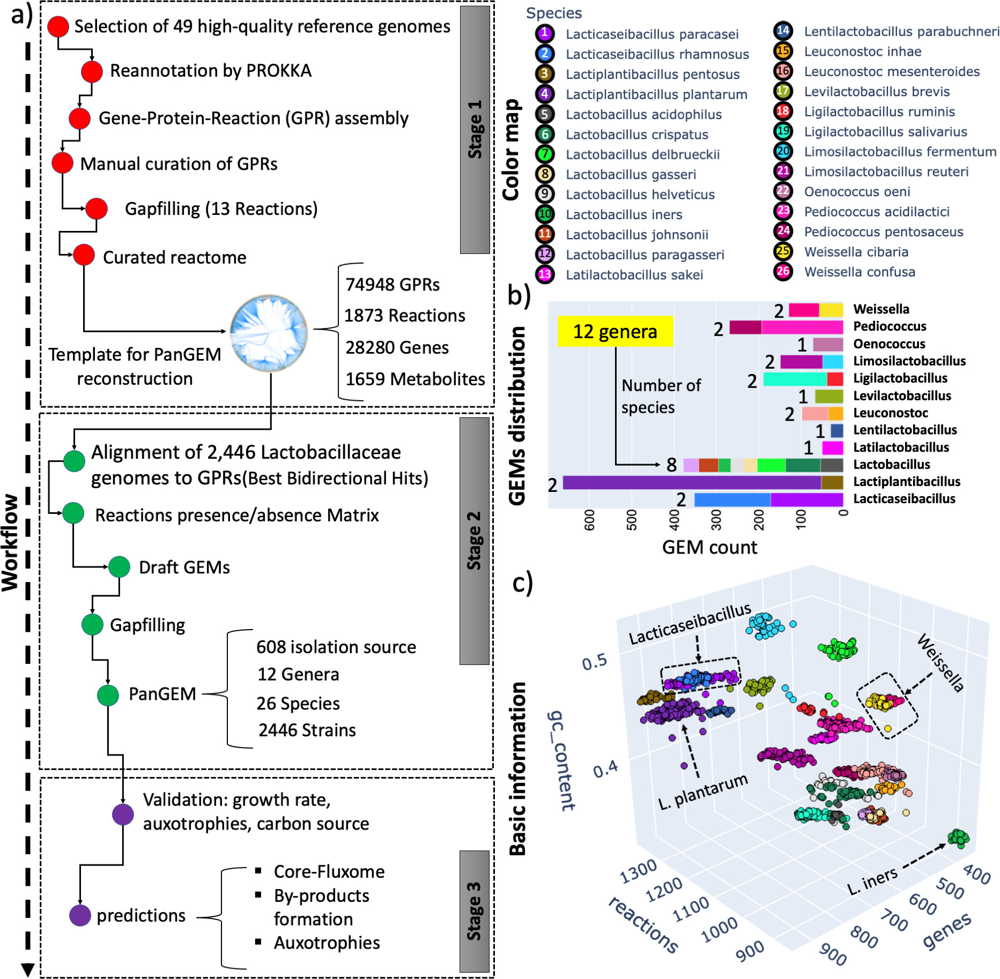

# Pangenome-Scale Reconstruction of Lactobacillaceae Metabolism
Automated reconstruction of strain-specific Genome-Scale Metabolic Models (GEMs) across the Lactobacillaceae family, with gap filling and downstream comparative analyses.

> End-to-end workflow: curated inputs → GEM generation → gap filling → QC/curation → flux/essentiality analyses → niche enrichment and panGEM FVA reports.

---

## Table of Contents
- [Overview](#overview)
- [Workflow](#workflow)
  - [1) GEM Generation (`GEMgenerator.py`)](#1-gem-generation-gemgeneratorpy)
  - [2) Gap Filling (`dgap.py`, `run_dgap.py`)](#2-gap-filling-dgappy-rundgappy)
  - [3) Manual Curation](#3-manual-curation)
  - [4) Reporting & Analysis Tools](#4-reporting--analysis-tools)
- [Figure](#figure)
- [Directory Layout](#directory-layout)
- [Dependencies](#dependencies)
- [Quick Start](#quick-start)
- [Reproducibility](#reproducibility)
- [Citation](#citation)
- [License](#license)

---

## Overview
This repository provides code and documentation to reconstruct **strain-specific GEMs** for Lactobacillaceae. The workflow is optimized for high-performance environments (e.g., 96 cores on Azure) but can be adapted to smaller or larger machines.


<p align="center">
  
</p>

<p align="center"><em>Figure 1. High-level workflow for automated pangenome and metabolic modeling.</em></p>


---

## Workflow

### 1) GEM Generation (`GEMgenerator.py`)
Generates draft strain-specific GEMs.

**Inputs**
- Reactome model (JSON)
- Gene sequences for Reactome GPRs:
  - Nucleotide FASTA (`.fna`)
  - Amino acid FASTA (`.faa`)
- GenBank files (`.gbk`) for target strains

**Output**
- Draft strain-specific GEMs (one model per strain)

**Example**
```bash
python GEMgenerator.py \
  --reactome data/reactome_model.json \
  --genes-fna data/sequences/genes.fna \
  --genes-faa data/sequences/genes.faa \
  --genbank  data/genomes/ \
  --out      results/gems_draft \
  --threads  96
